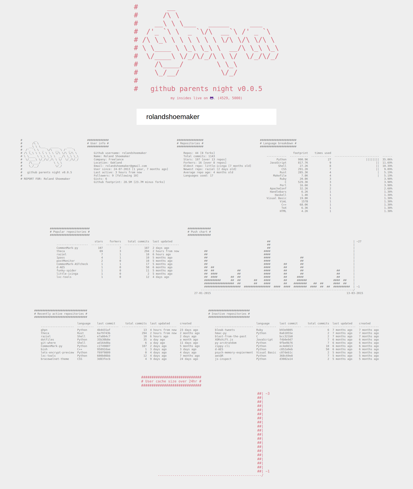

# ghpn

*github parents night* (or `ghpn`) is a Github user analysis tool offering both a CLI script and a web application.

`ghpn` was originally conceptualized as an alternative to [*osrc*]() (before it broke) to provide a more individualized,
less wordy report for a user (also ascii charts!!!!) without having to parse the entire history of github.

`ghpn` breaks user stats down into different *blocks* that will only be generated if enough information can be gained
from github for that block. These blocks are either various kinds of table or ascii charts at the moment.

Both the `ghpn` CLI tool and the web application rely on `libghpn.py` which provides all the core functionality and uses
[`github3.py`](). The web application uses an extremely simple [*JQuery*]() based single-page frontend, a [*flask*]() based
backend and *Python* background workers to process users in a *Redis* queue..

## early ghpn page

